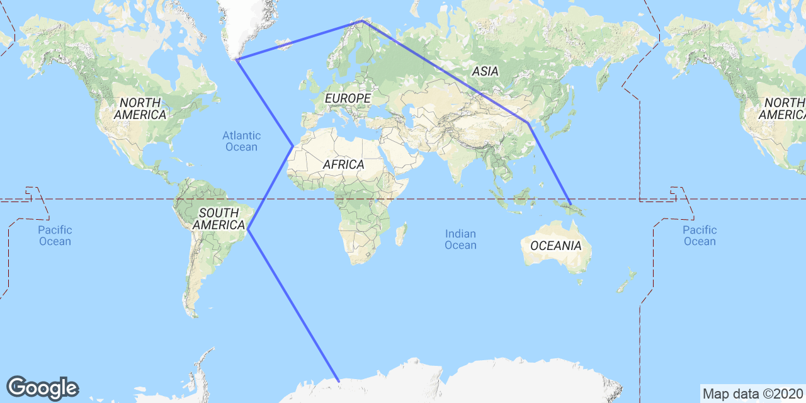

# seven_continents
## Overview
This software searches for optimal solutions for a variant of the [Traveling Salesman problem](https://en.wikipedia.org/wiki/Travelling_salesman_problem). It was written to help me find the shortest path between all seven continents while obeying a number of mission constraints, such as:
* Aircraft range and performance
* Airport size
* Runway type, length, surface material, and restrictions
* [US State Department Travel Advisories](https://travel.state.gov/content/travel/en/traveladvisories/traveladvisories.html)
* Winds aloft

The first time the program is run, it will analyze the supplied mission constraints and build a cache of distances between each valid airport. This can take several minutes and consume a few hundred MB of disk space, but it makes the actual search algorithm over 10x faster.

After the cache is built (or after a previously built cache is loaded from disk), the search algorithm starts by hashing airports into buckets based on their latitude and longitude. The first search pass treats all airports in the same hash bucket as a single airport which substantially reduces the search space. This simplified search is run randomly a certain number of times.

Then, the top 20 routes are optimized with a more expensive but more exhaustive search. It looks at each airport along the top routes and examines whether the other airports in the same hash bucket would lead to a faster overall route. This generally results in around a 0.5% - 2.5% improvement in overall route length and only takes a few seconds.

There are many other ways to solve this problem. This algorithm is not the fastest or the most optimal. I simply wanted something that would run in under an hour and produce reasonably good results. On my laptop it takes about 40 minutes to search 100 million possible routes, and it seems like this is already beyond the point of diminishing returns. Running the search for 10x as long often produces routes only about 1-2% better.

Lastly, the modeling used for aircraft performance, flight profiles, and weather is extremely simplistic. This enables faster searching but yield less accurate results. I sent some of my top routes to a professional flight department to be benchmarked and found that my simple modeling led to only ~2.5% error for a ~40 hour route. Better modeling would certainly improve the error, but it would likely be slower.

## Sample Usage

To force the search to start with an airport from Antarctica and then go to one in South America:

```python seven_continents.py --start-from-continent-codes AN,SA```

To fix the first three airports to KOAK, SBGL, and FACT:

```python seven_continents.py --start-from-airport-codes KOAK,SBGL,FACT```

## Sample Output
An HTML report is generated for analyzing the results. The top routes are listed and visualized using the Google Maps API. You can view a full sample report [here](results/sample/sample.html). Included in the report are images like this:



## Command Line Options

More options are available via the command line interface:
```
$ python seven_continents.py --help
usage: seven_continents.py [-h] [--max-searches MAX_SEARCHES]
                           [--routing-overhead-pct ROUTING_OVERHEAD_PCT]
                           [--start-from-airport-ids START_FROM_AIRPORT_IDS]
                           [--start-from-airport-codes START_FROM_AIRPORT_CODES]
                           [--start-from-continent-codes START_FROM_CONTINENT_CODES]
                           [--disable-geo-overrides]
                           [--disable-jet-stream-correction]
                           [--disable-optimization]
                           [--num-best-routes NUM_BEST_ROUTES]
                           [--jet-stream-correction-mph JET_STREAM_CORRECTION_MPH]
                           [--google-api-key GOOGLE_API_KEY]
                           [--geo-hash-resolution_deg GEO_HASH_RESOLUTION_DEG]
                           [--geo-hash-shuffles GEO_HASH_SHUFFLES]
                           [--optimization-radius-mi OPTIMIZATION_RADIUS_MI]
                           [--optimization-max-searches OPTIMIZATION_MAX_SEARCHES]
                           [--html-file HTML_FILE] [--data-path DATA_PATH]

Seven Continents Marathon Challenge route solver

optional arguments:
  -h, --help            show this help message and exit
  --max-searches MAX_SEARCHES
                        Maximum number of routes to search before terminating.
  --routing-overhead-pct ROUTING_OVERHEAD_PCT
                        Overhead percentage (as a decimal) that should be
                        added to route length to account for routing
                        inefficiencies.
  --start-from-airport-ids START_FROM_AIRPORT_IDS
                        Force search to start from a comma separated list of
                        airport ids.
  --start-from-airport-codes START_FROM_AIRPORT_CODES
                        Force search to start from a comma separated list of
                        airport codes.
  --start-from-continent-codes START_FROM_CONTINENT_CODES
                        Force search to start from a comma separated list of
                        continent codes (NA, EU, etc.).
  --disable-geo-overrides
                        Do not use geo-political overrides to determine
                        whether islands and other countries are part of
                        continents.
  --disable-jet-stream-correction
                        Do not apply a corrections to east and western
                        components of travel using jet stream assumptions.
  --disable-optimization
                        Do not run a secondary optimization pass to look for
                        more efficient airports within each hash bucket.
  --num-best-routes NUM_BEST_ROUTES
                        Number of best routes to store.
  --jet-stream-correction-mph JET_STREAM_CORRECTION_MPH
                        Speed correction to use, in mph, for eastbound
                        component of travel.
  --google-api-key GOOGLE_API_KEY
                        Google maps API key, for displaying route maps
                        (optional)
  --geo-hash-resolution_deg GEO_HASH_RESOLUTION_DEG
                        Reduce search space by consolidating airports within
                        geo_hash_resolution_deg degrees of lat/long into a
                        single airport.
  --geo-hash-shuffles GEO_HASH_SHUFFLES
                        Number of times to reshuffle the airport selected
                        within each geo hash bucket during the search.
  --optimization-radius-mi OPTIMIZATION_RADIUS_MI
                        Radius in miles to search around each waypoint for
                        alternates.
  --optimization-max-searches OPTIMIZATION_MAX_SEARCHES
                        Maximum number of searches to complete during each
                        route optimization.
  --html-file HTML_FILE
                        Output report file (default is 'report.html').
  --data-path DATA_PATH
                        Path to CSV files (default is 'data/').
```

## Credits
Airport data from [Our Airports](https://ourairports.com/data/)
